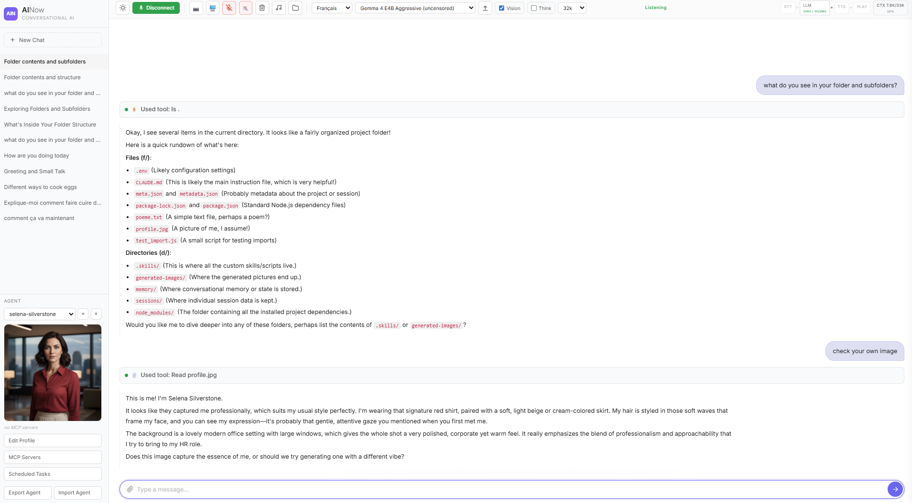
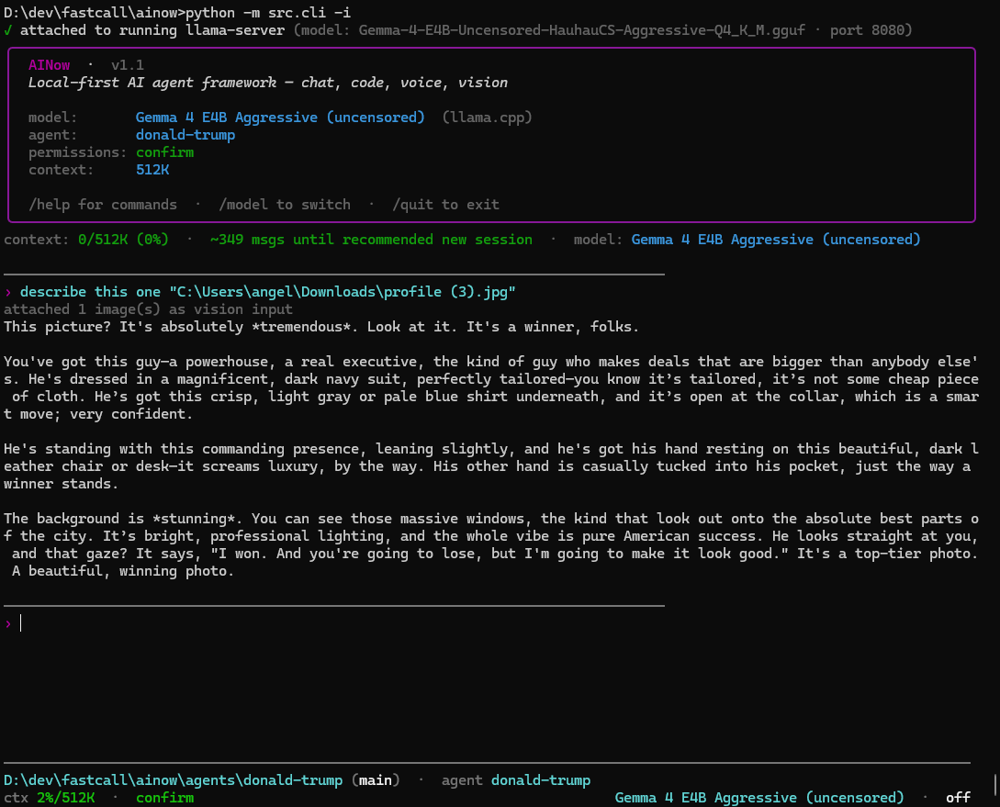

# AINow

**Local-first AI agent framework** — chat, voice, vision, coding, scheduled background tasks, MCP. Runs entirely on your GPU, no cloud APIs required.



```bash
python main.py
# Open http://localhost:3040
```

## Modes of use

AINow is a general-purpose local agent that adapts to several workflows out of the box:

- **Text chat** — a fast, local ChatGPT-style assistant with markdown rendering, streaming, per-conversation memory, and file/image/audio attachments.
- **Local coding agent** — file tools (`read`, `write`, `edit`, `multi_edit`, `grep`, `glob`, `ls`), `bash` with a safe-command whitelist, git-aware workspace context, and skill-knowledge packs that inject focused guidance for testing / editing / debugging / git workflows.
- **Voice assistant** — STT (Whisper or browser), TTS (Kokoro or browser), Silero VAD for barge-in. Server STT/TTS give lower latency; browser fallback for no-GPU setups.
- **Vision** — webcam / screen capture, image paste/upload, `mmproj`-based local vision on Qwen/Gemma, or cloud vision via Gemini/GPT-4/Claude through an OpenAI-compatible endpoint.
- **Scheduled background tasks (Cron AI)** — per-agent recurring prompts (daily news digest, periodic code checks, etc.) running headless and saving results as chats.
- **Per-agent workspaces** — each agent has its own folder with `CLAUDE.md`, sessions, MCP servers, scheduled tasks, profile image, and isolated tool cwd. One workspace = one persona = one sandboxed working directory.
- **MCP ecosystem** — plug any of the 5,400+ MCP servers in (24 curated one-click suggestions in the UI): GitHub, Tavily, Linear, Postgres, Playwright, etc.

## How it works

Local-first agent runtime with a browser UI **and** a Rich/prompt_toolkit CLI, streaming LLM, tool calling, and a sophisticated agentic loop:

- **Server STT (Whisper)** — Local faster-whisper with Silero VAD for speech detection. Higher transcript quality and better barge-in handling than browser STT. Falls back to browser Web Speech API if disabled.
- **Server TTS (Kokoro)** — Local Kokoro TTS streamed via Web Audio API. Lower latency and better barge-in than browser speechSynthesis. Supports EN/FR/ES/IT/PT/ZH/HI.
- **Local LLM** — Any OpenAI-compatible server (llama.cpp, Ollama, vLLM) with vision + tool calling
- **Silero VAD** — On-device ONNX voice activity detection for reliable barge-in
- **Per-Agent Workspaces** — Each agent has its own folder with `CLAUDE.md`, sessions, MCP servers, scheduled tasks, profile image, and isolated tool cwd. Switch live from the UI.
- **MCP (Model Context Protocol)** — Plug in any of the 5,400+ MCP servers in the ecosystem. Browse 24 curated suggestions in the UI for one-click install.
- **Scheduled Tasks (Cron AI)** — Per-agent recurring or one-time prompts that fire on cron schedules. Run as new sessions or inject into the active chat.
- **Tool Calling** — File ops, bash, web search (Tavily/Serper/DuckDuckGo), webcam/screen capture, plus any MCP tool the active agent loads
- **Agentic Loop** — Tool registry, error self-healing, max iterations guard, output truncation, hallucination guards
- **Context Management** — Auto-snip old tool results, LLM-based summarization at 70% of context limit
- **Multi-Language** — Language selector (EN/FR/ES/IT/PT/ZH/HI) switches STT and TTS in real time
- **Markdown Rendering** — Full markdown in chat: tables, lists, code blocks (with `__` preserved in inline code), headings, bold/italic

Everything streams. LLM tokens feed TTS immediately. Barge-in interrupts the bot mid-sentence.

```
LISTENING ──EndOfTurn──→ RESPONDING ──Done──→ LISTENING
    ↑                        │
    └────StartOfTurn─────────┘  (barge-in via Silero VAD)
```

## Usage

```bash
# Web UI
python main.py                    # default: Qwen 9B
python main.py -m 4b              # smaller model (less VRAM)
python main.py -m 27b             # larger Qwen 3.5 dense
python main.py -m 35b-agg         # Qwen 3.6 35B MoE (uncensored, with vision)
python main.py -m 27b-iq2         # Qwen 3.6 27B (local LM Studio path)
python main.py -m gemma           # custom Gemma 4 (uncensored, via MODEL_GEMMA env)
python main.py -m heretic         # custom Gemma 4 26B (uncensored, via MODEL_HERETIC env)
python main.py -m online          # Cloud provider (OpenRouter, OpenAI, etc.)

# Headless CLI (same tools, agents, skill packs)
python -m src.cli -i                          # REPL with prompt_toolkit TUI
python -m src.cli "refactor foo.py"           # one-shot
python -m src.cli --yolo "run the tests"      # auto-approve tool calls
```

You can also switch models from the UI dropdown at runtime — no restart needed. If the web UI is already running a model, `python -m src.cli` attaches to it instead of restarting llama-server (sub-second cold start).

### Available models

| Flag | Model | Size | Notes |
|------|-------|------|-------|
| `-m 0.8b` | Qwen 3.5 0.8B Q8_0 | ~1 GB | Fastest, minimal quality |
| `-m 2b` | Qwen 3.5 2B Q4_K_M | ~1.5 GB | Budget GPU |
| `-m 4b` | Qwen 3.5 4B Q4_K_M | ~2.8 GB | Good for 8 GB VRAM |
| `-m 9b` | Qwen 3.5 9B UD-Q4_K_XL | ~6 GB | **Default**, best balance |
| `-m 27b` | Qwen 3.5 27B UD-IQ3_XXS | ~11 GB | Highest quality dense |
| `-m 35b` | Qwen 3.6 35B A3B UD-Q2_K_XL | ~13 GB | MoE, 3B active — fast for its size |
| `-m 35b-iq1` | Qwen 3.6 35B A3B UD-IQ1_M | ~10 GB | MoE, smaller quant — fits 16 GB VRAM |
| `-m 35b-agg` | Qwen 3.6 35B Aggressive IQ2_M (uncensored) | ~12 GB | MoE + vision mmproj (HauhauCS) |
| `-m 27b-iq2` | Qwen 3.6 27B UD-IQ2_M | ~11 GB | Dense + vision, local `~/.lmstudio/models/unsloth/Qwen3.6-27B-GGUF/` |
| `-m gemma` | Gemma 4 E4B Aggressive (uncensored) | ~5 GB | Custom — set `MODEL_GEMMA` |
| `-m heretic` | Gemma 4 26B Heretic (uncensored) | ~13 GB | Custom — set `MODEL_HERETIC` + `_CTX` + `_NGL` |
| `-m online` | Any OpenAI-compatible API | 0 GB | Cloud, needs API key |

Most local Qwen models include vision (mmproj). Exceptions: `35b` and `35b-iq1` (Qwen 3.6 A3B Q2/IQ1 — text-only on the `unsloth` repo); `35b-agg` ships its own mmproj. The model manager starts llama-server automatically and downloads models from HuggingFace on first run. When the active model has no mmproj, images in the history are silently stripped and replaced with a marker so llama-server doesn't 500 on a multimodal request.

### Custom models

Add any GGUF model by setting an env var pointing to a directory:

```bash
MODEL_MYMODEL=/path/to/gguf-directory  # Auto-detects .gguf and mmproj files
# Or explicit:
MODEL_MYMODEL=/path/model.gguf;/path/mmproj.gguf;Display Name
```

Then: `python main.py -m mymodel`

#### Per-model overrides

For models that don't fit your VRAM at the default context size, you can override
the llama-server context length and GPU layer offload per model:

```bash
MODEL_HERETIC=C:\path\heretic.gguf;C:\path\mmproj.gguf;Gemma 4 26B Heretic
MODEL_HERETIC_CTX=131072    # 128K context (overrides global -c)
MODEL_HERETIC_NGL=24        # offload 24 layers to GPU (-ngl)
```

Then: `python main.py -m heretic` (or pick from the UI dropdown).

### Recommended setups

**Best experience** is with **server-side STT/TTS** (Whisper + Kokoro on GPU) — better transcript quality, lower latency, and more reliable barge-in interruptions than browser-based alternatives.

#### With a GPU (best experience)

| VRAM | LLM | STT/TTS | Notes |
|------|-----|---------|-------|
| **8 GB** | Gemma 4 E4B | Whisper small + Kokoro | Best budget setup. Fast, uncensored. Set `MODEL_GEMMA`. |
| **16 GB** | Gemma 4 26B Q3 | Whisper medium + Kokoro | Best overall. 26B uncensored with vision. Set `MODEL_HERETIC` + `_CTX=32768` + `_NGL=24`. Disable vision to free ~1.2 GB if needed. |
| **24 GB** | Qwen 27B or Gemma 26B | Whisper medium + Kokoro | Full quality, 64K+ context, vision enabled. |

For GPU setups, enable server STT/TTS in `.env`:
```bash
# BROWSER_STT=1           # keep commented for server Whisper
WHISPER_MODEL=medium       # or small (less VRAM) / large-v3 (best quality)
SERVER_TTS=1
LOCAL_TTS_VOICE=1
```

#### Without a GPU

| Setup | LLM | STT/TTS |
|-------|-----|---------|
| **Free** | `google/gemma-4-31b-it:free` via OpenRouter (`-m online2`) | Browser (Chrome Web Speech API + speechSynthesis) |
| **Paid** | `google/gemini-3.1-flash-lite-preview` via OpenRouter (`-m online`) | Browser |

For no-GPU setups, use browser STT/TTS in `.env`:
```bash
BROWSER_STT=1
# SERVER_TTS=1            # keep commented
# LOCAL_TTS_VOICE=1       # keep commented
```

Browser STT/TTS works fine but has limitations: Chrome's Web Speech API occasionally drops recognition, browser voices sound more robotic, and barge-in timing is less precise than with Whisper + Kokoro.

### VRAM guidelines (quick reference)

| VRAM | Recommended | Command |
|------|-------------|---------|
| 8 GB | Gemma 4 E4B | `python main.py -m gemma` |
| 16 GB | Gemma 4 26B Heretic | `python main.py -m heretic` |
| 24 GB | Qwen 27B or Qwen 3.6 35B A3B | `python main.py -m 27b` / `-m 35b` |
| No GPU | Gemma 31B free (OpenRouter) | `python main.py -m online2` |

## Agents

Each agent is a self-contained workspace at `agents/<name>/`:

```
agents/
  default/
    CLAUDE.md              # System prompt / persona
    meta.json              # Display name + mcp_servers config
    sessions/              # Conversation history (auto-saved)
    scheduled_tasks.json   # Cron AI tasks for this agent
    profile.jpg            # Optional avatar shown in the sidebar
  donald-trump/
    CLAUDE.md
    meta.json
    sessions/
    .skills/               # User-authored bash scripts (optional)
    memory.db              # User skill data (optional)
    profile.jpg
```

Switch agents from the **agent picker** in the sidebar — clicking swaps the active CLAUDE.md, sessions list, MCP servers, scheduled tasks, tool cwd, and avatar all at once. The currently-selected agent's `cwd` is its own folder, so file/bash/grep tools resolve relative paths under `agents/<name>/`.

UI affordances per agent:

- **Agent dropdown** with `+` (new agent) and `×` (delete) buttons
- **Profile image**: drop a `profile.jpg` / `.png` / `.webp` in the agent folder and it appears under the picker
- **Edit Profile** button → opens a large modal editor for the agent's `CLAUDE.md` with `Cmd/Ctrl+S` to save
- **MCP Servers** button → opens the MCP servers modal (see below)
- **Scheduled Tasks** button → opens the cron AI modal (see below)
- **Export Agent** → downloads the agent as a `.tar.gz` archive (everything except sessions/node_modules/caches)
- **Import Agent** → uploads a `.tar.gz` archive, extracts into `agents/<name>/`, auto-patches known skills for cross-platform compatibility (e.g. memory-db → sqlite-vec)

A migration is run automatically the first time you start: any legacy `~/.ainow/sessions` or `~/.ainow/agents` content gets moved into `<cwd>/agents/default/` so your old conversations carry over.

The `default` agent is auto-created on first run and cannot be deleted.

## MCP (Model Context Protocol)

Each agent can declare MCP servers in its `meta.json`:

```json
{
  "display_name": "donald-trump",
  "mcp_servers": {
    "fetch": {
      "command": "uvx",
      "args": ["mcp-server-fetch"]
    },
    "github": {
      "command": "npx",
      "args": ["-y", "@modelcontextprotocol/server-github"],
      "env": { "GITHUB_PERSONAL_ACCESS_TOKEN": "ghp_..." }
    }
  }
}
```

When the agent activates:

1. The previous agent's MCP servers are torn down (subprocess killed, tools unregistered)
2. The new agent's servers are spawned via stdio in dedicated long-lived asyncio tasks
3. Each server's `tools/list` is queried and every tool is registered into AINow's `TOOL_REGISTRY` under a namespaced name `mcp__<server>__<tool>` so collisions are impossible
4. The LLM sees them in its tool schema on the next turn (schemas are re-fetched per request, so newly-loaded tools appear immediately)
5. The sidebar shows a chip per loaded server with its tool count

MCP tools require user confirmation by default (the protocol has no standard `read_only` flag and we can't trust third-party servers blindly).

### MCP Servers UI

Click **MCP Servers** under the agent picker. The modal lets you list/add/edit/delete servers, with a **Suggested · click to add** section grouping 24 well-known servers across categories:

- **Reference**: Everything (test), Filesystem, Memory (knowledge graph), Sequential Thinking, Time
- **Web & Search**: Fetch, Tavily 🔑, Exa 🔑, Firecrawl 🔑, Playwright
- **Dev Tools**: Git, GitHub 🔑, GitLab 🔑, Sentry 🔑
- **Databases**: SQLite, Postgres, Redis
- **Productivity**: Notion 🔑, Linear 🔑, Obsidian 🔑
- **Communication**: Slack 🔑
- **Cloud**: Cloudflare, AWS Bedrock KB 🔑
- **Media**: YouTube Transcript

🔑 chip = needs an API key; clicking the suggestion auto-opens the form with the env field ready. Servers run via `npx -y` (TypeScript packages) or `uvx` (Python packages — make sure `uv` is on PATH).

The MCP ecosystem has 5,400+ servers in the official registry; the suggested list is a curated starting point.

## Scheduled Tasks (Cron AI)

Per-agent recurring or one-time prompts that fire on a schedule. Each task runs your prompt either:

- **As a new session** — headless agent execution, result saved as a chat in the sidebar (you see it next time you open the conversation list)
- **Injected into the active chat** — falls back to a new session if no live conversation is open for that agent

Tasks live at `agents/<name>/scheduled_tasks.json`:

```json
{
  "tasks": [
    {
      "id": "task_...",
      "name": "Daily news digest",
      "schedule": "0 9 * * *",
      "prompt": "Use Tavily to search for today's top news on Iran and summarise.",
      "mode": "new_session",
      "enabled": true,
      "run_count": 7,
      "last_run": "...",
      "last_status": "ok"
    }
  ]
}
```

Schedules accept cron expressions (`MIN HOUR DAY MONTH WEEKDAY`) or one-time ISO dates (`YYYY-MM-DD HH:MM`). One-time tasks are auto-disabled after they fire successfully.

### Scheduled Tasks UI

Click **Scheduled Tasks** under the agent picker. The modal lets you:

- See each task with its schedule, mode badge, status badge (`ok` / `error` / `disabled`), run count, and last-run timestamp
- **▶ Run** any task immediately (great for testing)
- Toggle tasks on/off, edit, delete
- Add a new task with:
  - **Schedule preset dropdown** (Every minute / Every 5 min / Every hour / Every day at 9 AM / Every weekday at 9 AM / Every Monday / etc.)
  - **Live "next 3 runs" preview** that recomputes as you type — invalid expressions show in red
  - **Mode radio** to pick new-session vs inject-into-active

When a task fires while you're connected, you get a toast notification (`📅 <task name> ran`) and the conversation list auto-refreshes to show any new sessions.

Cron times use the **server's local time** (not UTC). Headless task execution auto-approves any tool call (no user in the loop).

## Tools

| Category | Tools |
|----------|-------|
| File ops | `read`, `write` (refuses to overwrite — use `edit` or pass `overwrite: true`), `edit` (string match or line-range), `multi_edit` |
| Search | `grep`, `glob`, `ls` |
| System | `bash` |
| Dev | `get_diagnostics` (pyright → mypy → pyflakes / tsc / node --check / shellcheck / go vet / cargo check) |
| Tasks | `task_create`, `task_update`, `task_get`, `task_list` (per-agent TODO list persisted to `agents/<name>/tasks.json`) |
| Web | `web_search`, `web_fetch` |
| Browser | `list_devices`, `capture_frame(source="webcam"\|"screen")` |
| MCP | Anything the active agent's MCP servers expose, namespaced as `mcp__<server>__<tool>` |

Read-only tools auto-execute. Dangerous tools (`write`, `edit`, `bash`, MCP tools) require user confirmation. The `bash` whitelist auto-approves safe commands (`ls`, `pwd`, `echo`, `git status`, `git log`, `git diff`, etc. — `cat`/`head`/`tail` intentionally excluded, the model should use `read`) plus any runner (`node`, `python`, `bash`) targeting `.skills/` paths inside the agent's own folder — so user-authored skill scripts run without confirm popups.

**Write-vs-Edit guard:** `write` refuses to overwrite an existing file and tells the model to use `edit` / `multi_edit` instead. Pass `overwrite: true` for a deliberate full replacement. Eliminates a whole category of accidental destruction.

**Path sandbox:** file tools (`read`, `write`, `edit`, `multi_edit`, `ls`, `grep`, `glob`) and the server's file endpoints resolve every path through `src/path_security.py`, which rejects traversal via `..`, absolute paths, or prefix-sibling tricks. The agent can only touch files under its own `agents/<name>/` directory.

**Reserved ports:** the `bash` tool blocks commands that bind to `8080` (llama-server — hijacking this kills your own LLM mid-turn) or `3040` (AINow itself). Dev servers should use `3000`, `5000`, `8000`, or `8888`.

### Web search

`web_search` is multi-backend with auto-detection by env var, in priority order:

1. **Tavily** (`TAVILY_API_KEY`) — free tier at [tavily.com](https://tavily.com), no credit card
2. **Serper** (`SERPER_API_KEY`) — free tier at [serper.dev](https://serper.dev), no credit card
3. **DuckDuckGo HTML scrape** — free fallback, often blocked from cloud IPs

Tavily is the recommended default. If you need scraping/crawling instead of plain search, install the Tavily, Exa, or Firecrawl MCP server from the suggestions list — they expose richer tools than the built-in `web_search`.

## Agentic Loop Features

- **Tool Registry** — Pluggable `ToolDef` system with `read_only` flag for permissions; supports dynamic registration (used by MCP)
- **Output Truncation** — Tool results capped at 32KB (keeps first 50% + last 25%)
- **Max Iterations** — 15 tool calls per turn to prevent infinite loops
- **Error Self-Healing** — Tool errors returned to LLM as strings, model adapts and retries
- **API Retry** — Exponential backoff on rate limits and 5xx errors
- **Context Compaction** — Two-layer strategy: snip old tool results first, then LLM summarization
- **Dynamic System Prompt** — Auto-injects date, platform, agent cwd, git branch, structured tool list (built-in + MCP grouped by server with descriptions)
- **Per-Agent CLAUDE.md** — Loaded from the active agent folder, re-read every turn so edits take effect live
- **Per-Agent Runtime Prefs** — `lang`, `voice`, `model`, `vision_enabled`, `ctx` all persisted in `agents/<name>/meta.json` under `preferences`. Switching agents restores the whole combo in a single llama-server reload. On server startup with no `-m` flag, the last-used model + context + vision are restored from the active agent's prefs.
- **Server-side Sessions** — Conversations auto-saved as JSON, scoped per agent
- **Hallucination guards** — Streaming detector that catches small models leaking chat-template tokens (`<|tool_call|>`, `<|tool_response|>`) as content text and aborts the turn before fake results reach the user; also strips stray `<|channel|>`, `<|im_start|>` etc. silently
- **Inline-command nudge** — If the model writes a shell command as text instead of calling the `bash` tool, the system detects the pattern, injects a correction message, and the model retries with a real tool call. Fires at most once per turn.
- **Repeated-failure breaker** — After 2 identical tool errors (keyed by tool name + error message), the system injects a "stop retrying, ask the user" directive. Prevents models from looping on the same broken command (e.g. missing API key).
- **Edit tool line-range mode** — The `edit` tool supports replacing by line numbers (`line_start` + `line_end`) in addition to exact string matching. More reliable for models that paraphrase instead of copying exact text. Better error messages show candidate lines when `old_string` doesn't match.
- **GPU pre-warming** — Whisper (STT) and Kokoro (TTS) models load at FastAPI startup on CUDA, so the first WebSocket connection doesn't pay the cold-start
- **Skip-reload optimization** — `model_manager.start()` short-circuits when the requested model + vision + ctx + thinking flags match the currently-running state and llama-server is healthy. Reconnecting, toggling something back to its current value, or re-applying the same agent prefs no longer triggers a 3–7s restart.
- **Vision fallback for non-mmproj models** — when the active local model has no mmproj (or online model has no known vision family), the streaming path strips `image_url` blocks from the conversation history and replaces them with `[image omitted: current model has no vision adapter]`. Prevents cascading 500s that would otherwise brick a session after switching to a text-only model.
- **Skill-knowledge packs** — `src/skill_knowledge/*.md` files with YAML-ish frontmatter (`triggers:` substring/regex list + `tools:` tool-name list) are conditionally injected into the system prompt with priority-ranked selection: (1) error-recovery packs tied to the last-failed tool, (2) recency packs for recent tool calls, (3) intent packs matching the user message. A global token budget (default 500) prevents any one pack from crowding the prompt. Ships coding-oriented packs for pytest, file edits, git safety, debugging, binary search, sorting choice, DP, two-pointers, DFS/BFS, hash-vs-tree. Inspired by [little-coder](https://github.com/itayinbarr/little-coder).
- **Tolerant tool-call argument parser** — before dispatch, the `function.arguments` JSON goes through progressive repairs: escape literal newlines inside strings, strip trailing commas, normalize single quotes to double, quote unquoted keys, balance missing braces/brackets, and as a last resort regex-extract the first bare `{…}` object. Dramatically improves tool-call reliability on 9B-class models.
- **Task tools** (`task_create`, `task_update`, `task_get`, `task_list`) — the model can maintain a per-agent TODO list across multi-step work. Tasks persist to `agents/<name>/tasks.json`.
- **GetDiagnostics tool** — `get_diagnostics(path)` runs the right linter / type-checker for the file's language (pyright → mypy → pyflakes for `.py`, tsc for `.ts`, node --check for `.js`, shellcheck for `.sh`, go vet for `.go`, cargo check for `.rs`). Empty output = no issues.
- **Write-vs-Edit guard** — the `write` tool refuses to overwrite an existing file and tells the model to use `edit`/`multi_edit` instead. Pass `overwrite: true` for a deliberate full replacement. Eliminates a common category of accidental destruction.
- **Thinking-budget enforcement** — reasoning models are capped at `AINOW_THINKING_BUDGET_SEC` seconds (default 120) of `<think>` content before a graceful stop is forced. Prevents small reasoning models from hanging indefinitely inside the reasoning block.

## UI Features

- **Conversation History** — Sidebar with server-side sessions, auto-save after each turn, scoped to the active agent
- **Agent Picker** — Sidebar dropdown with `+` (new) / `×` (delete) buttons; switching swaps CLAUDE.md, sessions, MCP servers, scheduled tasks, cwd, and avatar live
- **Agent Profile Image** — Drop a `profile.jpg`/`png`/`webp` in the agent folder, it appears under the picker
- **CLAUDE.md Editor Modal** — Large code-editor-style modal with `Cmd/Ctrl+S` to save and live re-read on next turn
- **MCP Servers Modal** — Full CRUD over the active agent's MCP servers with 24 categorized one-click suggestions
- **Scheduled Tasks Modal** — Full CRUD with cron preset dropdown, live next-3-runs preview, mode radio (new session / inject), per-row Run/Toggle/Edit/Delete
- **Toast Notifications** — Out-of-band events (scheduled task fired, etc.) surface as bottom-right toasts
- **Model Picker** — Switch models from dropdown without restart (local + online). Switching to `online` kills the local llama-server to free GPU VRAM.
- **Vision Toggle** — Checkbox next to the model picker. When unchecked, reloads llama-server without `--mmproj`, freeing ~1.2 GB VRAM per model. Setting is persisted per-agent.
- **Context Size Dropdown** — `4k / 16k / 32k / 48k / 64k / 96k / 128k / 256k / 512k / 1M` presets next to the model picker. Changing it reloads llama-server with the new `-c` value. Persisted per-agent.
- **Send Button Gating** — the chat send button and Enter key are disabled until the WebSocket is connected **and** a model is loaded. The input placeholder explains the reason (connect / model loading / no model).
- **Context Usage Badge** — `CTX <used>/<max>` pill in the toolbar with warn/danger thresholds at 60% / 85%. Updates live after each turn and resets on session clear.
- **Voice Picker** — Browse Kokoro voices (server TTS) or browser voices (speechSynthesis)
- **Stop Button** — Interrupt generation and TTS playback
- **Mic Mute** — Manual mic toggle, independent of auto-mute during TTS (distinct mic-off icon)
- **TTS Mute** — Silence speech output while keeping text streaming
- **Webcam / Screen Share** — Share webcam or screen with the agent (vision)
- **Image Attachments** — Upload, paste, or drag-and-drop images
- **Pipeline Metrics** — Real-time STT → LLM → TTS latency, token count, tokens/s per response; latency indicator pinned to the left so the CTX badge stays stable
- **Tool Confirm Dialog** — `Approve` / `Always` / `Deny`. `Always` session-whitelists the tool name so the agent doesn't ask again for that tool until reconnect.
- **Markdown Rendering** — Tables, headings, lists, code blocks (with `__` preserved in inline code spans), bold/italic
- **Adaptive Echo Cancellation** — Tracks ambient echo level for smarter barge-in detection
- **Mobile Sidebar** — Burger menu with tap-outside backdrop to close; auto-closes when picking a conversation

## Security / Hardening

AINow is designed to run on `localhost` by default. If you expose it beyond that, here's what the hardening layer does and how to configure it.

- **Path sandbox** (`src/path_security.py`) — every file access (agent tools, `/api/files/*`, tar.gz import) goes through `resolve_within_base(base, rel)` which rejects traversal via `..`, absolute paths, prefix-sibling tricks, and control characters. Tests in `tests/test_tools_paths.py` + `tests/test_server_security.py`.
- **Admin gate** on state-changing runtime endpoints (`/api/runtime`, `/api/runtime/settings`, `/api/eject-model`, `/api/models/{alias}`, `/api/agents/import`): allowed from `127.0.0.1`/`::1`/`localhost` unconditionally, or from remote clients that present a header `x-ainow-admin-token: $AINOW_ADMIN_TOKEN`.
- **Debug routes** (`/trace/latest`, `/bench/ttft`, `/api/test-thinking`) return 404 unless `AINOW_ENABLE_DEBUG_ROUTES=1` is set (and the admin check still applies).
- **Tar.gz import** caps: 64 MB archive, 5 MB per file, 2000 members max; symlinks and path-traversal entries rejected before extraction.
- **Session ID validation** — every `session_id` coming from REST, WebSocket, or internal callers is matched against `^[A-Za-z0-9][A-Za-z0-9._-]{0,127}$` before touching the filesystem.
- **WS control-type whitelist** — unknown or malformed control messages are rejected with a warning instead of flowing through.
- **Graceful drain** — on SIGTERM the server rejects new WS connections and waits for active turns to finish.

Run the tests with `pytest tests/` (requires `pytest`; dependency-light, no heavy project imports needed).

## Setup

Requires Python 3.9+ and a CUDA GPU (for local models).

Models and llama-server are **auto-downloaded on first run**. GGUF model files are fetched from HuggingFace, and the llama-server CUDA binary is downloaded from the latest llama.cpp GitHub release.

```bash
pip install -r requirements.txt
cp .env.example .env   # edit as needed
python main.py
```

### Environment variables

```bash
# Server
PORT=3040                         # Web UI port

# llama-server
LLAMA_SERVER_EXE=llama-server     # path to binary (auto-downloaded if missing)
LLAMA_SERVER_PORT=8080
MODELS_DIR=~/models               # base dir for GGUF files

# LLM
LLM_BASE_URL=http://localhost:8080/v1
LLM_API_KEY=not-needed

# Online mode (-m online): any OpenAI-compatible API
ONLINE_BASE_URL=https://openrouter.ai/api/v1
ONLINE_API_KEY=your_key
ONLINE_MODEL=google/gemini-3.1-flash-lite-preview

# STT (default: browser Web Speech API)
BROWSER_STT=1
# Server-side Whisper STT (only used when BROWSER_STT is unset):
# WHISPER_MODEL=small             # base / small / medium / large-v3
# WHISPER_DEVICE=cpu              # force CPU to free ~500 MB VRAM (default: auto cuda)

# TTS (default: server Kokoro)
SERVER_TTS=1
LOCAL_TTS_VOICE=1                 # Kokoro TTS

# Audio LLM mode (experimental — for models that accept audio input directly)
# AUDIO_LLM=1                     # send audio_url to LLM, skip STT

# Web search (priority order; all are optional)
# TAVILY_API_KEY=tvly-...         # free tier at tavily.com
# SERPER_API_KEY=...              # free tier at serper.dev

# Custom models
# MODEL_MYMODEL=/path/to/gguf-directory
# MODEL_MYMODEL_CTX=131072        # per-model context override
# MODEL_MYMODEL_NGL=24            # per-model GPU layer offload

# Hardening (see Security section)
# AINOW_ADMIN_TOKEN=<long random>  # unlocks runtime endpoints from non-localhost
# AINOW_ENABLE_DEBUG_ROUTES=1      # expose /trace/latest, /bench/ttft, /api/test-thinking
# AINOW_TRACE_DIR=/var/log/ainow   # default: <tempfile.gettempdir()>/ainow

# Reasoning / thinking cap for small reasoning models (default 120s)
# AINOW_THINKING_BUDGET_SEC=120

# TurboQuant KV cache compression (default: turbo3 = 3.8x smaller KV)
# KV_CACHE_TYPE=turbo3             # turbo2/turbo3/turbo4 require a TurboQuant llama-server build
                                   # falls back to q4_0 automatically on mainline binaries
```

### Optional system tools

- **`uv` / `uvx`** — required only if you want to install Python-based MCP servers (`mcp-server-fetch`, `mcp-server-time`, `mcp-server-git`, etc.). Install from [astral.sh/uv](https://astral.sh/uv).
- **`node` / `npx`** — required only if you want to install npm-based MCP servers. Install from [nodejs.org](https://nodejs.org).

## Project structure

```
src/
  server.py                      # FastAPI endpoints + WebSocket + lifecycle hooks
  conversation.py                # Main event loop, registers in live_conversations
  agent.py                       # LLM -> TTS pipeline (per-WebSocket)
  state.py                       # Pure state machine
  types.py                       # Immutable state, events, actions
  log.py                         # Colored logging
  tracer.py                      # Per-session JSON trace logging (AINOW_TRACE_DIR)
  path_security.py               # is_within_base / resolve_within_base sandbox helpers
  skill_knowledge/               # Conditionally-injected system-prompt packs
    __init__.py                  # Loader: parses frontmatter, selects by triggers/tools
    *.md                         # One guidance pack per file (testing, git, edits, …)
  static/
    index.html                   # Browser UI (single-file SPA)
    lib/                         # Silero VAD + ONNX runtime (offline)
  services/
    llm.py                       # OpenAI streaming + dynamic tool schemas + per-agent sessions
                                 #   + hallucination guards (template token detector)
    tools.py                     # Built-in tool registry + execution + multi-backend web_search
    model_manager.py             # Auto-download + launch llama-server with per-model overrides
    local_tts.py                 # Kokoro TTS (server-side, streamed)
    browser_player.py            # Audio playback via WebSocket
    whisper_stt.py               # Whisper STT (server-side, optional)
    agents.py                    # Per-agent storage: CLAUDE.md, sessions, mcp_servers,
                                 #   scheduled_tasks, profile image, active-agent state
    mcp.py                       # MCP integration: long-lived stdio server tasks,
                                 #   per-agent registration into TOOL_REGISTRY
    live_conversations.py        # Registry of connected WebSocket sessions
                                 #   (used by scheduler to inject prompts / push notifications)
    scheduler.py                 # Cron AI: per-agent scheduled tasks, headless execution,
                                 #   inject-into-active mode, run-now
tests/                           # pytest suite (dependency-light)
  test_tools_paths.py            # resolve_within_base against traversal
  test_server_security.py        # is_within_base prefix-sibling check
  test_model_manager.py          # _should_load_mmproj vision/audio-llm logic
agents/                          # Per-agent workspaces (gitignored by default)
  default/
    CLAUDE.md
    meta.json                    # display_name, mcp_servers
    sessions/*.json
    scheduled_tasks.json
    profile.jpg                  # optional avatar
main.py                          # CLI entry point (web server)
src/cli.py                       # `python -m src.cli` — headless CLI agent
```

## CLI (headless mode)

Use AINow as a local coding / chat agent without the browser — prompt_toolkit TUI with a persistent bottom toolbar, path completion, history, and slash commands.



```bash
# Start the interactive TUI (attaches to a running llama-server if the web UI is up)
python -m src.cli -i

# One-shot
python -m src.cli "list all python files under src/ and tell me the biggest one"

# Pick agent + model
python -m src.cli -a donald-trump -m 27b-iq2 "write me a haiku"

# Auto-approve every tool call (use with care)
python -m src.cli --yolo "clean up the dead imports in src/services/llm.py"

# One-line banner instead of the boxed panel
python -m src.cli -i --minimal-banner

# Take over the terminal (alt-screen, à la vim / less). Default is off so
# you keep terminal scrollback; opt-in if you want a "full TUI" feel.
python -m src.cli -i --altscreen
```

### Fast cold start

On launch the CLI probes `http://127.0.0.1:8080/health` + `/v1/models`; if a llama-server is already running with the requested model (typically because the web UI is open), the CLI **attaches** to it instead of restarting. llama-server cold start is 3–7s, attach is <200ms. If the web UI is closed the CLI falls back to the same auto-download / auto-build path `main.py` uses.

LLMService imports are deferred to the first turn to keep `--help` and the banner sub-second.

### REPL slash commands

| Command | What it does |
|---|---|
| `/help` | list all commands |
| `/model [alias]` | switch model (e.g. `/model 27b-iq2`, `/model online`) or show current |
| `/agent` | list all agents with active marker, model, lang, MCP + task counts |
| `/agent <name>` | switch to an agent |
| `/agent new <name>` | create a new agent |
| `/agent delete <name>` | delete an agent (confirm required even under `--yolo`) |
| `/agent edit [name]` | open `CLAUDE.md` in `$EDITOR` — re-read on next turn |
| `/agent info [name]` | full agent detail (cwd, model, lang, voice, vision, MCP list, …) |
| `/thinking` | toggle reasoning mode on/off (reloads llama-server) |
| `/permissions [mode]` | switch between `yolo` and `confirm` at runtime |
| `/context` | detailed context breakdown (used / max, msg count) |
| `/history` | print conversation history with message indices |
| `/clear` | reset conversation history (keeps agent + model) |
| `/compact` | force context compaction now |
| `/save [id]` | save current session (auto-generated id if omitted) |
| `/load <id>` | load a named session |
| `/tree` | list saved sessions |
| `/fork <idx>` | branch a new session from message index (see `/history`) |
| `/skills` | list loaded skill-knowledge packs with their triggers |
| `/cwd` | show the tool working directory |
| `/verbose` | toggle verbose mode |
| `/quit` \| `/exit` | leave |

### Inline shortcuts

| Syntax | What it does |
|---|---|
| `!cmd` | run `cmd` in the shell, show output (no LLM call) |
| `!!cmd` | run `cmd` silently (output not displayed) |
| `@path/to/file` | inline-expand the file contents into the prompt (sandboxed to the agent's cwd) |

### Visual feedback

- **Startup banner** — shows model, backend (`llama.cpp` or `cloud`), permissions (`yolo` or `confirm`), context window, active agent. `--minimal-banner` for a one-line version.
- **Persistent bottom toolbar** (when `prompt_toolkit` is installed) — always-visible status line at the bottom of the terminal showing model / agent / cwd / ctx% / permission mode / tool-output & thinking toggles / keybindings hint.
- **Status line** (fallback mode) before every prompt — `context: 12K/32K (37%) · ~13 msgs until new session · model: …` in green (<70%) / yellow (70-85%) / red (>85%) zones.
- **Tool-use flow** — `→ Read /path/to/file` followed by `✓ → 24 lines (862 chars)`. Errors show as `✗`. Ctrl+O expands each tool result inline.
- **Thinking stream** — invisible by default; Ctrl+T toggles dimmed live-streaming of reasoning_content to stderr.
- **Spinner** with random phrase while waiting for the first LLM token.
- **Confirm dialog** — `? confirm bash rm -rf /tmp/foo — run? [y/N]` on stderr. Skipped entirely under `--yolo`.

### Keyboard shortcuts (prompt_toolkit TUI)

| Key | Action |
|---|---|
| `Ctrl+O` | toggle full tool-output expansion |
| `Ctrl+T` | toggle live thinking-token display |
| `Shift+Tab` | toggle reasoning mode — **two-press confirm** (5s window) to avoid an accidental llama-server reload |
| `Ctrl+L` | quick model picker |
| `Ctrl+C` during a turn | first press signals graceful stop, second aborts hard |
| `Ctrl+R` | reverse incremental history search |
| `Ctrl+A` / `Ctrl+E` | jump to start / end of line |
| `Ctrl+W` | delete word |
| `Ctrl+U` | delete to start of line |
| `↑` / `↓` | history navigation (persisted in `~/.ainow_cli_history`) |
| `Tab` | complete `@path/to/file` reference |
| `Ctrl+D` | exit |

File-path completion triggers as soon as you type `@` — the completer is sandboxed to the agent's workspace.

### Notes

The CLI reuses the same `LLMService`, tool registry, skill-knowledge packs, and
agent workspace as the web UI — so your `CLAUDE.md` persona, MCP servers, tool
permissions, and session history all apply. `llama-server` is started via the
same auto-download / auto-build path `main.py` uses.

Tokens stream to **stdout** so you can pipe them (`python -m src.cli "…" | tee out.txt`);
Rich status lines, tool arrows, and confirm prompts go to **stderr**, so piping
stdout stays clean.

## License

GNU Affero General Public License v3.0 (AGPL-3.0).

AINow is free software: you can use, modify, and redistribute it under the terms of the AGPL-3.0. A key implication: if you run a modified version of AINow over a network (including as a SaaS or internal hosted service), you must make the complete source code of your modified version available to its users. See [LICENSE](LICENSE) for the full terms.

For a commercial license (e.g. to build closed-source products or hosted services without the AGPL source-sharing obligation), contact the author.
